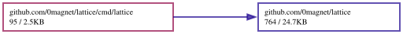

# lattice

A solid drawn as cross-sections, one terminal per section.

A volume of N×N×N voxels is cut three ways, N sheets across each axis, and
each sheet is an ordinary terminal showing where a turning solid's surface
crosses it. One sheet on its own is a flat picture of one slice. Stack 3N
terminals in space as transparent sheets, in three families each
perpendicular to the other two, and the solid appears in depth from every
side: whichever way it is turned, one family faces the viewer while the
other two are edge on.

`lattice` does not know whether it is in such a stack. Every instance turns
the solid by the wall clock and draws only its own slice, so any number of
them, in any terminals, stay in step with nothing between them.

```
lattice -axis z -slice 7          # one sheet
lattice -axis y -tile             # every sheet of the y axis, side by side
lattice -shape torus -once        # one frame, printed, and done
```

The middle front sheet of the sphere:

```
          ────────────
        ╱╱╱╱──    ──╲╲╲╲
      ╱╱╱╱            ╲╲╲╲
    ╱╱╱╱                ╲╲╲╲
  ││╱╱                    ╲╲││
  ││││                    ││││
  ││                        ││
  ││                        ││
  ││││                    ││││
  ││╲╲                    ╱╱││
    ╲╲╲╲                ╱╱╱╱
      ╲╲╲╲            ╱╱╱╱
        ╲╲╲╲──    ──╱╱╱╱
          ────────────
```

## Sheets

A sheet is `-n` voxels square (16 by default), a voxel two characters wide
so that it is square in a terminal: `2n` columns by `n` rows. `-slice` counts
from the far side toward the viewer the family faces.

| axis | seen from | right | up |
|---|---|---|---|
| `z` | the front | x | y |
| `x` | the right side | −z (the front is on the left) | y |
| `y` | above | x | −z (the front is at the bottom) |

Each is read unmirrored from its own side and mirrored from the other, as a
sign painted on glass is. A voxel is lit when the surface passes through it,
decided per voxel, so the three sheets through a voxel always agree, and it is
colored by where it is, so it is the same color in all three.

## Drawing

- `-shape`: sphere, torus, cube, octahedron, gyroid.
- `-style lines` (the default) writes the line the surface makes across the
  sheet, `─ │ ╱ ╲`, and `·` where the surface lies along the sheet instead;
  `ascii` is the same in `- | / \ .`; `shade` writes how squarely the surface
  crosses the sheet, `.:-=+*#`; `solid` fills every lit voxel.
- `-spin` and `-pitch` turn and tilt the solid, in degrees a second and
  degrees. `-mono` is one green; `-no-color` (or `NO_COLOR`) none at all.

Only the cells that changed are sent, so a mostly still, mostly empty sheet
costs almost nothing to keep on screen.

## As a library

The command is `lattice.Program`, so a host that keeps its own terminals can
run it in them frame by frame: the same flags, writing the same bytes.

```go
p, err := lattice.NewProgram([]string{"-axis", "y", "-slice", "3"}, os.Stderr)
if err != nil {
	return err
}
p.Enter(term)            // term: any io.Writer a terminal reads
for t := range frames {
	p.Frame(t)            // the solid as it stands at t
}
p.Leave()
```

`Sheet`, `BasisOf` and `Render` are the geometry underneath it, for a host
that places the sheets in space.

## Across many terminals

Every sheet of every axis, each in a tmux window of its own:

```
for a in x y z; do for k in $(seq 0 15); do tmux new-window -d "lattice -axis $a -slice $k"; done; done
```

Flat, that is 48 pictures of slices. The solid is only there when they are
stacked: [chaosrack](https://github.com/0magnet/chaosrack) is to show them
that way, as real terminals drawn as transparent sheets in 3-D.

## Dependency Graph

Made with [goda](https://github.com/loov/goda):

```
go run github.com/loov/goda@latest graph github.com/0magnet/lattice/... | dot -Tsvg -o docs/lattice-goda-graph.svg
```



## Lines of Code

Made with [gocloc](https://github.com/hhatto/gocloc) (excludes `vendor/`, `node_modules/`, `.git/`):

```
gocloc --not-match-d='(vendor|node_modules|\.git)' .
```

```
-------------------------------------------------------------------------------
Language                     files          blank        comment           code
-------------------------------------------------------------------------------
Go                               8             79            139            718
Markdown                         1             29              0            105
YAML                             1              0              7             98
Makefile                         1             19             34             89
Bourne Shell                     1              8             16             30
-------------------------------------------------------------------------------
TOTAL                           12            135            196           1040
-------------------------------------------------------------------------------
```
